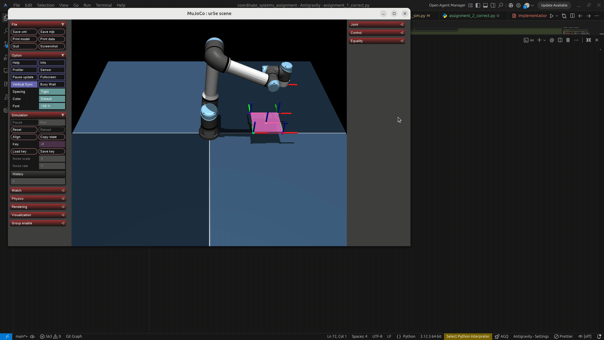

# 座標系（同次変換行列）学習プロジェクト

このプロジェクトは、ロボットシミュレーションを通して **同次変換行列（Homogeneous Transformation Matrix）** の使い方を実践的に学ぶ課題です。

## 📁 プロジェクト構成

| ファイル                  | 説明                                                  |
| ------------------------- | ----------------------------------------------------- |
| `geo.py`                  | `FRAME`, `VECTOR`, `MATRIX` クラスの定義（変更不要）  |
| `sample.py`               | FRAME の使い方を示すサンプルスクリプト                |
| `assignment_1.py`         | **課題 1**（初級）: 傾いたパレット上の 4 隅を巡回する |
| `assignment_2.py`         | **課題 2**（中上級）: カメラで見つけた部品を箱へ移す  |
| `assignment_2_correct.py` | 課題 2 の模範解答（実行可能）                         |
| `src/`                    | シミュレーション本体（変更不要）                      |
| `robot_arms/`             | ロボットモデル（変更不要）                            |

## 🚀 環境構築

```bash
# uv が未インストールの場合
python -m pip install -U uv

# uv を使って依存パッケージをインストール
uv sync

# サンプルを実行して動作確認
uv run python sample.py
```

## 📖 FRAME クラスの基本

`FRAME` は位置と姿勢（6 自由度）を表す同次変換行列のクラスです。

### 生成

```python
from geo import FRAME
import math

# xyzrpy で定義（x, y, z, roll, pitch, yaw）
T = FRAME(xyzrpy=[0.4, 0.0, 0.2, 0.0, math.radians(15), 0.0])
```

### 3 つの基本操作

| 操作               | コード       | 意味                                 |
| ------------------ | ------------ | ------------------------------------ |
| **連結（掛け算）** | `T_A * T_B`  | A 座標系上の B をワールド座標に変換  |
| **逆変換**         | `-T_A`       | A の逆行列（座標系の原点を移動）     |
| **値の取得**       | `T.xyzrpy()` | `[x, y, z, roll, pitch, yaw]` を返す |

### `xyzrpy` と `xyzabc` の違い（回転表現）

どちらも 3 軸回転で姿勢を表しますが、**角度の意味と合成順**が異なります。

| 表現                   | 角度の意味                               | 回転行列の合成           |
| ---------------------- | ---------------------------------------- | ------------------------ |
| `xyzabc=[x,y,z,a,b,c]` | `a`: X軸, `b`: Y軸, `c`: Z軸             | $R = R_x(a)R_y(b)R_z(c)$ |
| `xyzrpy=[x,y,z,r,p,y]` | `r`: roll(X), `p`: pitch(Y), `y`: yaw(Z) | $R = R_z(y)R_y(p)R_x(r)$ |

#### なぜ順序が重要？

3 次元回転は一般に可換ではありません。

$$
R_x(\alpha)R_y(\beta) \neq R_y(\beta)R_x(\alpha)
$$

そのため、同じ数値を入れても `xyzabc` と `xyzrpy` で最終姿勢は通常一致しません。

#### 動的オイラー角（Intrinsic）/ 静的オイラー角（Extrinsic）

- この資料では「`x → y → z` の順番で回す」という読み方にそろえて説明します。
- この前提では、以下のようになります。
   - `xyzrpy` は **静的オイラー角（Extrinsic）**
   - `xyzabc` は **動的オイラー角（Intrinsic）**

#### わかりやすい説明（静的回転と動的回転）

- **静的回転（Extrinsic）**
   - 常に「固定された世界座標の軸」で回します。
   - この場合、新しい回転 $R_{new}$ は常に左から掛けます。
   - $$
      v' = R_C \cdot R_B \cdot R_A \cdot v
      $$
      （$A$で回し、次に$B$で回し、最後に$C$で回す順序）

- **動的回転（Intrinsic）**
   - 「回転した後の自分自身の軸」で回します。
   - 数学的には、この操作は回転行列を右から掛けていくことに相当します。
   - $$
      v' = R_A \cdot R_{B'} \cdot R_{C''} \cdot v
      $$

#### 等価性のポイント（重要）

- 同じ最終姿勢は、
   - 「**動的で** $A \rightarrow B \rightarrow C$」
   - 「**静的で** $C \rightarrow B \rightarrow A$」
   のように、**逆順で等価に表せます**。


---

## 🤖 シミュレーション API

### 基本操作

```python
sim = RobotSimulation(xml_path)
sim.draw_axes(F1, F2, ...)             # 座標軸を可視化
sim.add_box(F, size=(w,h,d), rgba=...) # 静的な箱（パレット等）を描画
sim.move_arm(T_target)                 # ロボットを目標へ移動
sim.run()                              # シミュレーション開始
```

### ピッキング操作（課題 2 で使用）

```python
sim.spawn_object(T_obj_pos)    # ピッキング対象オブジェクト（小箱）を配置
sim.move_arm(T_pick)           # ピック位置へ移動
sim.catch()                    # 到達時にオブジェクトを掴む
sim.move_arm(T_place)          # プレース位置へ移動
sim.release()                  # 到達時にオブジェクトを離す
```

---

## 📝 課題 1: 傾いたパレット上の 4 隅を巡回する（初級）

**ファイル:** `assignment_1.py`

### テーマ

ロボットの前方で傾いて置かれているパレット（20cm × 20cm）の 4 隅をロボットが順に巡回します。

### やること

1. **パレットの視覚化**: `sim.add_box()` を使ってパレットを表示する
2. **座標計算**: パレット中心からの相対オフセットを用いて、4 隅のワールド座標を計算する
3. **巡回**: `sim.move_arm()` で 4 点を順に移動させる

### 🎬 正解動作の動画


---

## 📝 課題 2: カメラで見つけた部品を箱へ移す（中上級）

**ファイル:** `assignment_2.py`

### テーマ

カメラで検出した部品のワールド座標を求め、パレット座標系へ変換し、ピック＆プレースを行います。

### やること

1. **部品のワールド座標計算**
2. **パレット座標系への相対変換**（逆行列を使用）
3. **移動シーケンスの実装**:
   - `初期位置 -> 部品位置(Catch) -> パレット位置(Release) -> 初期位置`
   - ロボットのハンドは常に下向き（roll = math.pi）に保つこと

### 🎬 正解動作の動画


---

## ✅ 課題の提出方法

1. 新しいブランチを作成する、ブランチ名は自分の名前にする(例: `ito-yamato`)
2. 課題のコードを完成させ、**コミット** する
3. **プルリクエスト (Pull Request)** を作成して提出する
